| Nombre                       | Carnet    |
| ---------------------------- | --------- |
| Lesther Kevin Federico López Miculax   | 202110897 |


# PRACTICA 1   


La siguiente documentación es de suma importancia, ya que es fundamental comprender de manera precisa y detallada el funcionamiento del módulo del kernel. Una comprensión adecuada de este módulo es esencial.


## COMPILACION DE KERNEL

### Instalacion de dependencias

Las dependencias son parte fundamental para el proceso de la compilacion del kernel, ya que garantizan que los modulos requeridos se encuentre disponibles. A continuacion se colocan las necesarias.


```bash
sudo apt install build-essential libncurses-dev bison flex libssl-dev libelf-dev fakeroot dwarves
```


### Descargar y descomprimir el kernel


Posteriormente, es de suma importancia proceder a la descarga del Kernel en su versión 6.6.44, para garantizar que se cuente con la versión más reciente y compatible. Para ello, se debe acceder al sitio web oficial de kernel.org, el cual es el repositorio central y oficial donde se originan y se mantienen las versiones del Kernel de Linux.

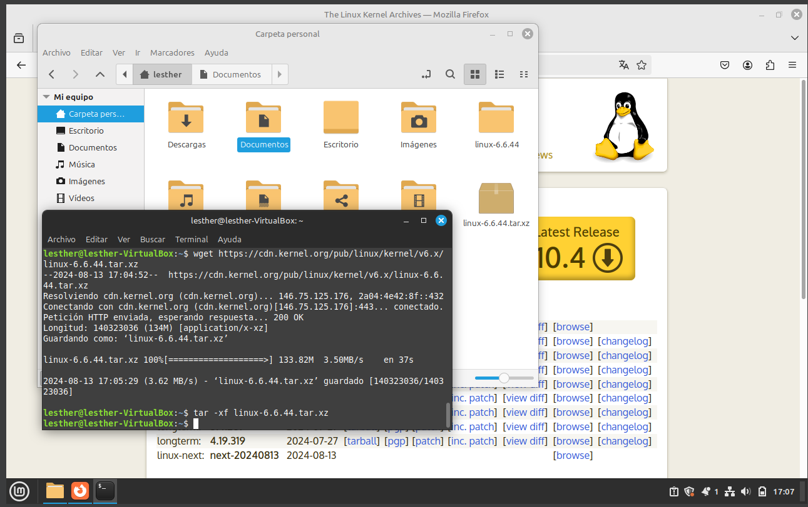

Implementamos los siguientes comandos para descargar y descomprimir el kernel:


- Descargar el kernel
```bash
wget https://cdn.kernel.org/pub/linux/kernel/v6.x/linux-6.6.44.tar.xz
```

- Descomprimir el kernel

```bash
tar -xf linux-6.6.44.tar.xz
```


### Configuracion del kernel


Una vez descomprimida y descargada la carpeta del kernel de linux se procede a configurar accediendo a la carpeta del mismo por medio del siguiente comando.

```bash
cd linux-6.6.44
```

Una vez ubicado en la direccion de la carpeta principal del kernel se procede a especificar el archivo .config con el comando localmodconfig que realiza un estudio de los modulos cargados en el sistema y modifica el archivo .config de forma que solo esos modulos se incluyan en la compilacion. Otra aclaracion importante es que al ejecutar el siguiente comando se debe presionar la tecla Enter cada vez que se solicite un Input.


```bash
make localmodconfig
```

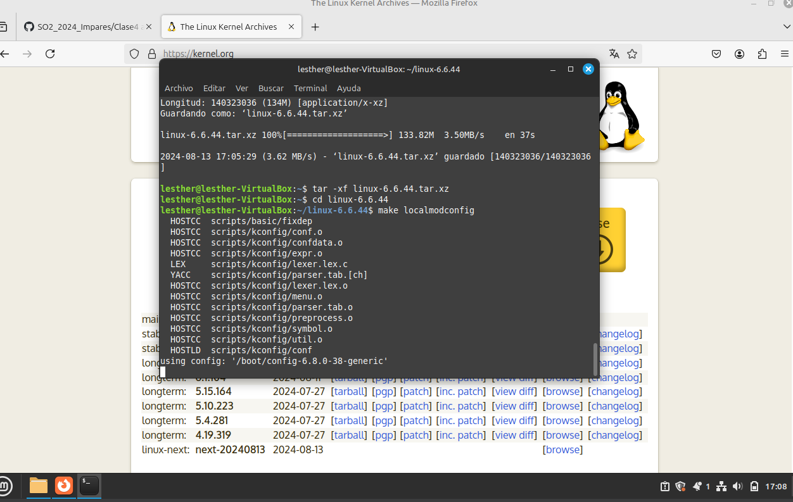


Una vez formado el .config se procede a modificarlo, puesto que dentro de ella vienen incluidas las llaves privas y es importante eliminarlos, por lo que se colocan los siguientes comandos:

```bash
scripts/config --disable SYSTEM_TRUSTED_KEYS
scripts/config --disable SYSTEM_REVOCATION_KEYS
scripts/config --set-str CONFIG_SYSTEM_TRUSTED_KEYS ""
scripts/config --set-str CONFIG_SYSTEM_REVOCATION_KEYS ""
```


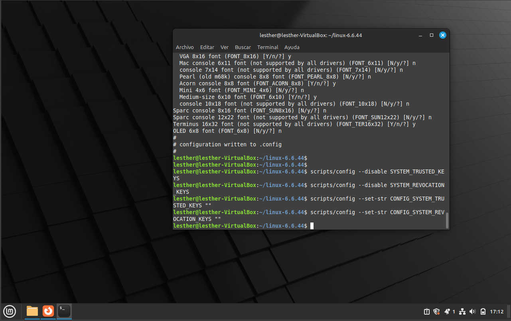


### Compilacion del kernel

Una vez completa la fase de la configuracion se procede a compilar con el comando adjunto a continuacion:


```bash
fakeroot make -j3
```

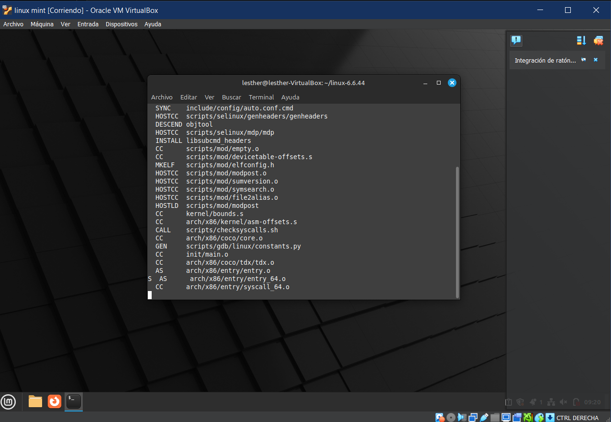

Donde la bandera -j especifica el numero de nucleos a utilizar para la compilacion.


Una vez completado la compilacion se coloca el siguiente comando para verificar si no existen inconvenientes.


```bash
echo $?
```


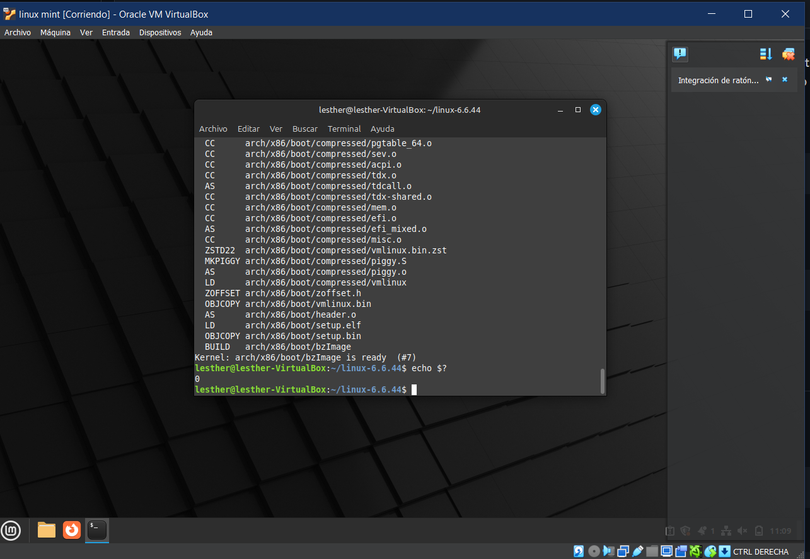


Si el comando retorna de valor '0' significa que no existen problemas, de lo contrario ocurrio la error.


### Instalacion del kernel

 Luego de la compilacion se realiza la instalacion iniciando con los modulos del kernel ejecutando.


```bash
sudo make modules_install
```


Posteriormente se instala el kernel con el siguiente comando:

```bash
sudo make install
```
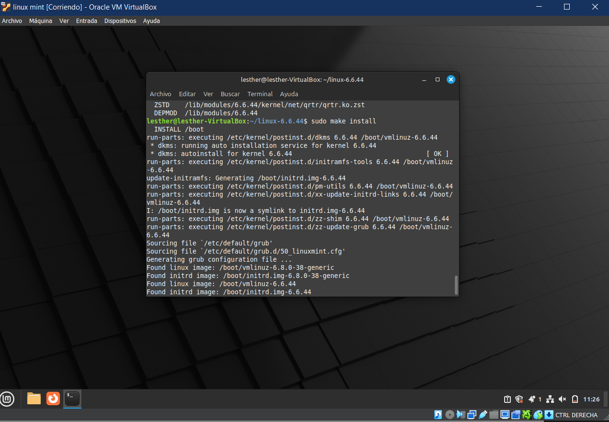


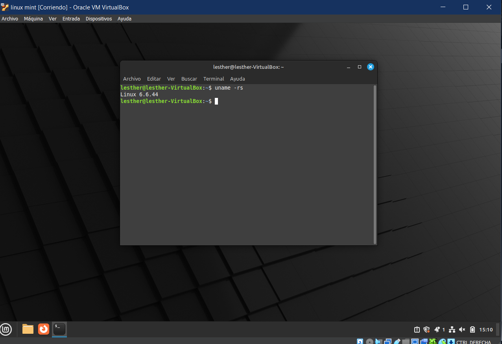


Finalmente, se reinicia la computadora para completar la instalacion y acceder al grup para poder seleccionar el kernel a utilizar.

```bash
sudo reboot
```

En el virtualizador de VirtualBox se presiona Shift cuando la maquina virtual esta arrancando, de este modo, se accede al GRUB y se procede a seleccionar el Kernel adecuado como lo describen las siguientes imagenes.


## MENSAJE PERSONALIZADO


Para el mensaje personalizado se accedio a la carpeta init dentro del directorio linux-6.6.44. Una vez en el directorio init se accede al archivo main.c por medio del siguiente comando:


```bash
nano main.c
```


Nano abre el archivo para editarlo, por lo que se busca en main.c la funcion start_kernel(), ya que dentro de ella se coloca el mensaje de bienvenida de la siguiente forma:

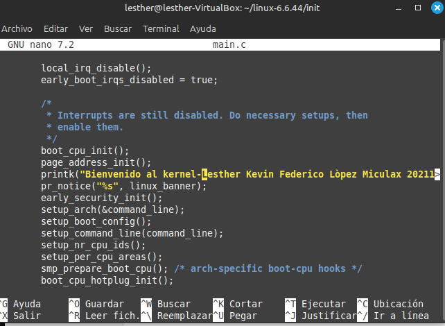


Posteriormente se observa el mensaje de bienvenida implementado con el siguiente comando:

```bash
dmesg
```

## UTS SYSNAME

Para el cambio de UTS Sysname se accedio al directorio kernel/include/liinux, dentro de el se encuentra el archivo uts.h que se abre en el editor por medio del comando nano. Una vez abierto el archvivo se dirige al aparto de 


Para confirmar el UTS Sysname cambiado se coloca el comando adjunto a continuacion:


```bash
uname -a
```

## SYSCALLS

### Agregar la syscall

El primer paso para que la syscall nueva funcione es que se debe crear un archivo C en el directorio Kernel. Una vez creado el archivo con el nombre que se prefiere se escribe dentro el codigo fuente de la syscall.


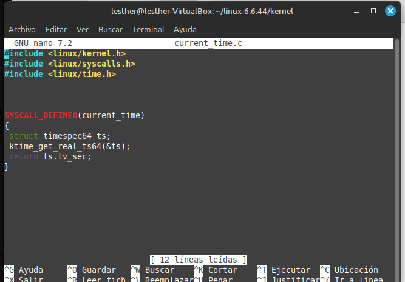


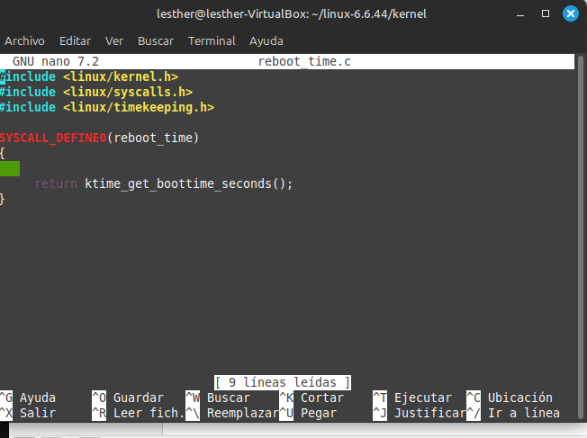


Posteriormente, se procede a incluir la definicion de la syscall en el archivo syscall.h, el cual se encuentra en el directorio include/linux. Se utiliza nano nuevamente para abrir el archivo y poder editar dentro de el, de este modo, se agrega la siguiente declaracion.

```bash
asmlinkage long sys_current_time(void);
```


El tercer paso es incluir la syscall en la tabla de syscalls, de este modo, se accede al directorio arch/86/entry/syscalls. Una vez en el directorio indicado se procede a utilizar nano para acceder al archivo syscall_64.tbl que contiene la tabla para agregar la syscall como se muestra en la imagen adjunta.


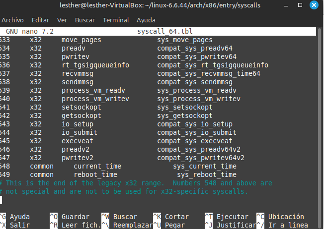


Finalmente, se modifica el archivo makefile en el directorio Kernel. Dentro de Makefile se coloca la siguiente linea de codigo para indicar que se debe compilar el archivo de la syscall para que pueda ser vinculada posteriormente.

```bash
obj-y += current_time.o
```

Una vez realizado estos pasos se procede a compilar nuevamente el kernel y a reiniciar el ordenador para poder realizar el testeo de las syscalls implentadas, de este modo, se utiliza el siguinte codigo en C para poder obtener respuesta de las nuevas syscalls.


```C
#include <stdio.h>
#include <unistd.h>
#include <sys/syscall.h>

#define current_time 548 
#define reboot_time 549 

int main() {
    long result;
    long result2;

   
    result = syscall(current_time);
    
 
    result2 = syscall(reboot_time);

    printf("Hora actual en segundos desde epoch: %ld\n", result);
    printf("Segundos desde el último reinicio: %ld\n", result2);
  
    return 0;
}

```


Luego de tener el codigo C se procede a compilar y obtener los resultados con los siguientes comandos:


```bash
$ gcc -o syscall syscall.c

$ ./syscall
```


## PROBLEMAS ENCONTRADOS


- Un problema encontrado es la compilacion del kernel, puesto que brinda error al momento de terminar la compilacion, de este modo, se tienen dos soluciones ante esto. Una solucion encontradas es subir el valor de la Memoria de la maquina virtual, de este modo, la compilacion se ejecuta de mejora manera. Por otro lado, otra solucion optima fue deshabilitar la generacion de informacion de depuracion BTF en el .conf del kernel, por consiguiente, se reduce el tamaño del kernel compilado y el tiempo de su compilacion. Los comandos para esto son los siguientes:


```bash
scripts/config --disable  CONFIG_DEBUG_INFO_BTF
scripts/config --disable  DEBUG_INFO_BTF_MODULES
```

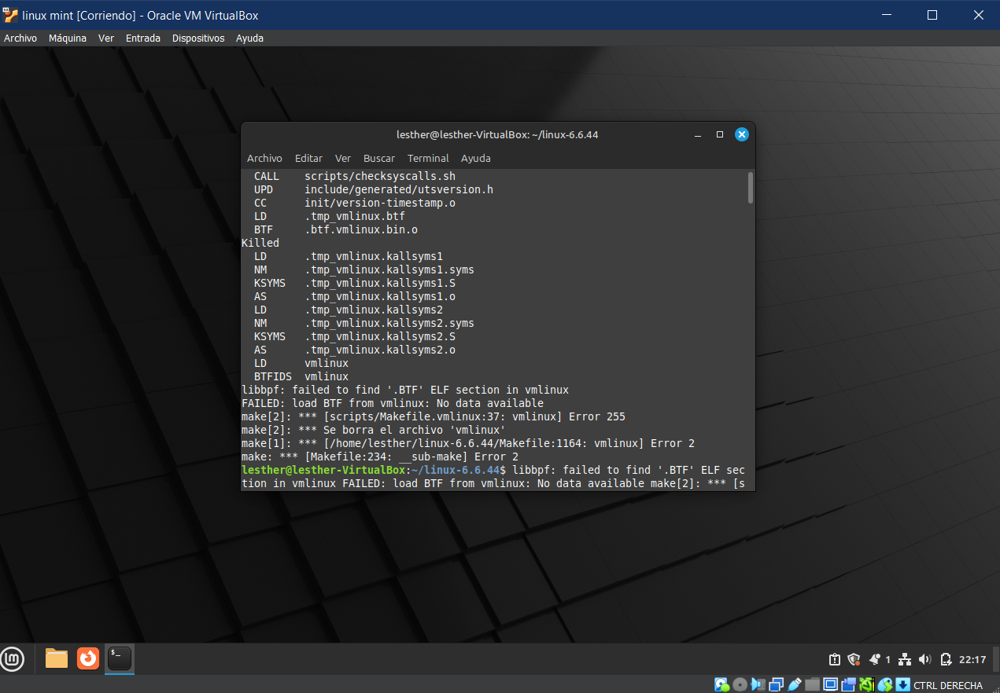


- Como segundo error durante este proceso se obtuvo que no era posible acceder al kernel instalado, de este modo, la solucion fue acceder a ella por medio del GRUB, el cual es accesible por medio de la presion de la tecla SHIFT al arrancar la maquina virtual. Una vez en el GRUB se selecciona el kernel a utilizar, el cual es Linux 6.6.44.


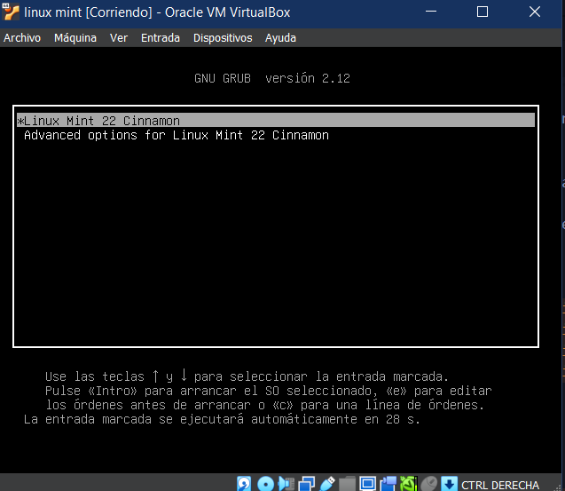


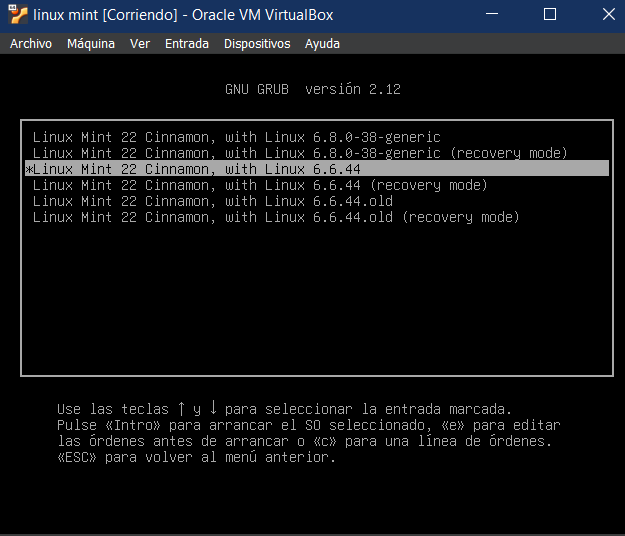


- Un tercer error que surge durante el proceso es en las syscalls, puesto que en ciertas ocasiones no se realiza el proceso de modificar el archivo Makefile del directorio Kernel, el cual es importante para incluir los archivos de la syscall en la compilacion.


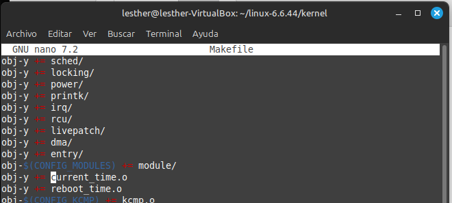