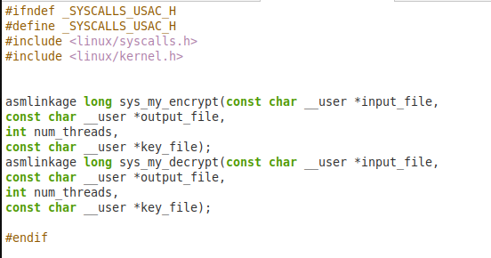
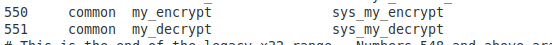

| Nombre                       | Carnet    |
| ---------------------------- | --------- |
| Lesther Kevin Federico López Miculax   | 202110897 |


# PRACTICA 2


La siguiente documentación es de suma importancia, ya que es fundamental comprender de manera precisa y detallada el funcionamiento del módulo del kernel. Una comprensión adecuada de este módulo es esencial.


## SYSCALLS

### Agregar la syscall

El primer paso para la creacaion de una nueva syscall y que funcione es que se debe crear un archivo C en el directorio Kernel. Una vez creado el archivo con el nombre que se prefiere se escribe dentro el codigo fuente de la syscall. En este caso el codigo para poder desencriptar y encriptar por medio de XOR. 

La syscall hace enfasis en los parametros que se deben enviar para que se pueda realizar de manera correcta la encriptacion, de este modo, se tiene el archivo de entrada, el archivo de salida, el numero de hilos y la clave o key.

```C
SYSCALL_DEFINE4(my_encrypt, 
const char __user *, input_file, 
const char __user *, output_file, 
int, num_threads, 
const char __user *, key_file)
```

Ademas, dentro del codigo se maneja un struct para poder manipular de mejor manera los datos.


```C
typedef struct {
    char *input;
    const char *key;
    int start;
    int end;
} ThreadParams;
```


Posteriormente, se procede a incluir la definicion de la syscall en un archivo nuevo llamada syscalls_usac.h, el cual se encuentra en el directorio include/linux. Se utiliza nano nuevamente para abrir el archivo y poder editar dentro de el, de este modo, se agrega la siguiente declaracion tomando en cuenta los parametros de la syscall.


```bash
asmlinkage long sys_my_encrypt(const char __user *input_file,
const char __user *output_file,
int num_threads,
const char __user *key_file);
```

Se agrega una definicion para la encriptacion y otra para la desencriptacion.





El tercer paso es incluir la syscall en la tabla de syscalls, de este modo, se accede al directorio arch/86/entry/syscalls. Una vez en el directorio indicado se procede a utilizar nano para acceder al archivo syscall_64.tbl que contiene la tabla para agregar las syscalls como se muestra en la imagen adjunta. Por consiguiente, la syscall 500 se vincula con la de la encriptacion y 501 con la de desencriptacion




Finalmente, se modifica el archivo makefile en el directorio Kernel. Dentro de Makefile se coloca las siguientes lineas de codigo para indicar que se debe compilar los archivos de las syscalls para que pueda ser vinculada posteriormente con las llamadas.

```bash
obj-y += my_decrypt.o
obj-y += my_encrypt.o
```


Una vez realizado estos pasos se procede a compilar nuevamente el kernel y a reiniciar el ordenador para poder realizar el testeo de las syscalls implentadas. En el siguiente punto se indica como compilar el kernel.


### Compilacion del kernel

Una vez completa la fase de la creacion de las syscalls se procede a compilar con el comando adjunto a continuacion:


```bash
fakeroot make -j3
```


Donde la bandera -j especifica el numero de nucleos a utilizar para la compilacion.


Una vez completado la compilacion se coloca el siguiente comando para verificar si no existen inconvenientes.


```bash
echo $?
```


Si el comando retorna de valor '0' significa que no existen problemas, de lo contrario ocurrio la error.


### Instalacion del kernel

 Luego de la compilacion se realiza la instalacion iniciando con los modulos del kernel ejecutando.


```bash
sudo make modules_install
```


Posteriormente se instala el kernel con el siguiente comando:

```bash
sudo make install
```


Finalmente, se reinicia la computadora para completar la instalacion y acceder al grup para poder seleccionar el kernel a utilizar.

```bash
sudo reboot
```

En el virtualizador de VirtualBox se presiona Shift cuando la maquina virtual esta arrancando, de este modo, se accede al GRUB y se procede a seleccionar el Kernel adecuado como lo describen las siguientes imagenes.


## Comprobacion de syscalls


Se desarrollaron las siguientes aplicaciones de espacio de usuario y para esto se utiliza el siguinte codigo en C para poder obtener respuesta de las nuevas syscalls. Se toma en cuenta que todos los argumentos seran obligatorios para correr la aplicacion, por lo que si hace falta uno se debe mostrar error.

```C
#include <stdio.h>
#include <stdlib.h>
#include <unistd.h>
#include <sys/syscall.h>
#include <string.h>

#define sys_my_encrypt 550  


int main(int argc, char *argv[]) {
    char *input_path = NULL;
    char *output_path = NULL;
    char *key_path = NULL;
    int thread_count = 0;
    int opt;

    // Procesar los argumentos de la línea de comandos
    while ((opt = getopt(argc, argv, "a:b:c:d:")) != -1) {
        switch (opt) {
            case 'a':
                input_path = optarg;
                break;
            case 'b':
                output_path = optarg;
                break;
            case 'c':
                thread_count = atoi(optarg);
                break;
            case 'd':
                key_path = optarg;
                break;
            default:
                return EXIT_FAILURE;
        }
    }

  
    if (!input_path || !output_path || thread_count <= 0 || !key_path) {
        fprintf(stderr, "Error: Hacen falta parametros.\n");
        return EXIT_FAILURE;
    }

   
    long status = syscall(sys_my_encrypt, input_path, output_path, thread_count, key_path);

    if (status == 0) {
        printf("Encriptacion con exitoso\n");
    } else {
        perror("Error en el proceso de encriptación");
        return EXIT_FAILURE;
    }

    return EXIT_SUCCESS;
}

```


Luego de tener el codigo C se procede a compilar y obtener los resultados con los siguientes comandos, donde siempre se toma en cuenta los parametros.


```bash
$ gcc -o encrypt_app encrypt_app.c

$ ./encrypt_app -a archivo_entrada.txt -b archivo_salida.txt -c 4 -d clave.txt
```


## PROBLEMAS ENCONTRADOS


- Un problema encontrado es la creacion del archivo syscalls_usac.h, archivo donde se realizan las llamadas al sistemas, de este modo, al momento de realizar la compilacion me tiraba error, por lo que la solucion fue importar este nuevo archivo en el codigo de las syscalls en lugar del tipico sys.h, al realizar esta correcion la compilacion se dió con exito.


```c
#include <linux/syscalls_usac.h>
```


- Como segundo error durante este proceso se obtuvo que ciertos valores nulos no permitian la decodificacion y codificacion de manera adecuada, de este modo, fue necesario implementar la eliminacion de estos caracteres no deseados para poder utilizar satisfactoriamente la codificacion y decodificacion XOR.

```c
static void clean_string(char *str) {
    int len = strlen(str);
    while (len > 0 && isspace(str[len - 1])) {
        str[len - 1] = '\0';
        len--;
    }
}

```


- Otro problema que se obtuvo fue que al compilar el codigo de las sycalls se obtenia que se tenia definiciones multiples con respecto a la funcion de encriptacion y desencriptacion, puesto que al no tener static las funciones se vuelven visibles, por lo que fue necesario colocar static para que la funcion sea unicamente visible al archivo donde se definio la funcion.

```c
static int xor_encrypt_decrypt(void *args) 
```


