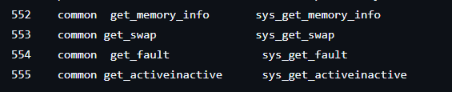
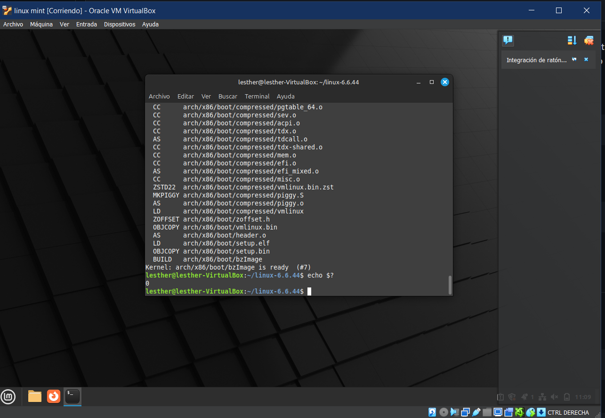
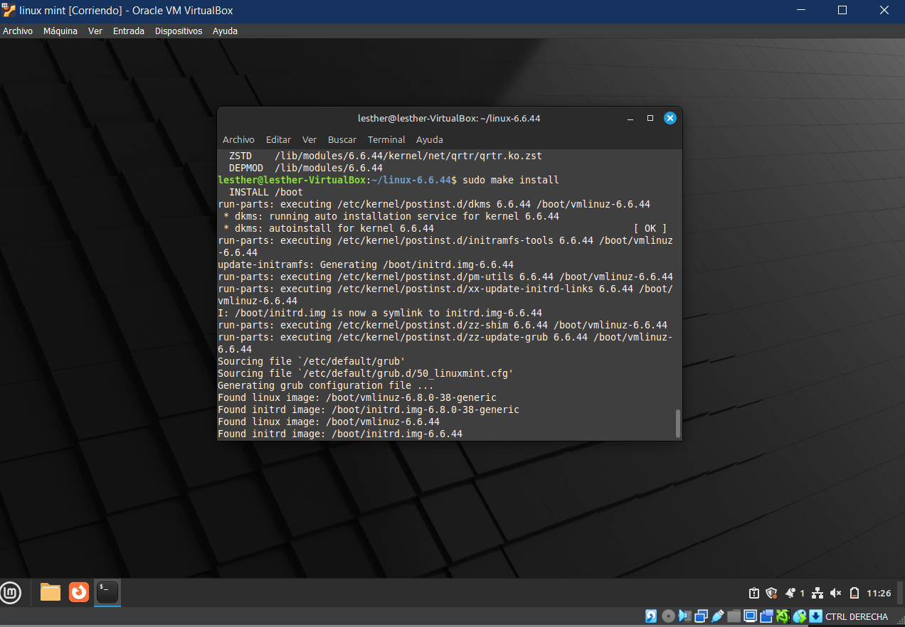
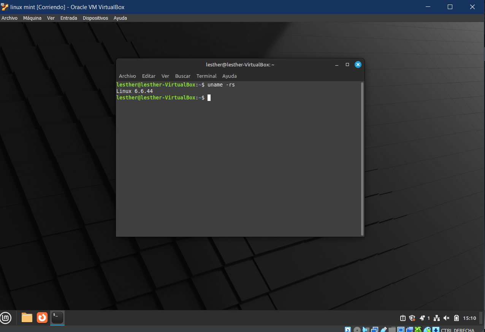

| Nombre                       | Carnet    |
| ---------------------------- | --------- |
| Lesther Kevin Federico López Miculax   | 202110897 |


# PRACTICA 2


La siguiente documentación es de suma importancia, ya que es fundamental comprender de manera precisa y detallada el funcionamiento del módulo del kernel. Una comprensión adecuada de este módulo es esencial.


## SYSCALLS

### Agregar la syscall

El primer paso para la creacaion de una nueva syscall y que funcione es que se debe crear un archivo C en el directorio Kernel. Una vez creado el archivo con el nombre que se prefiere se escribe dentro el codigo fuente de la syscall. En este caso se formaron cuatro, los cuales son para obtener informacion sobre la memoria fisica y swap, ademas de paginas con fallos, activas e inactivas.

La syscall hace enfasis en los parametros que se deben enviar para que se pueda realizar de manera correcta, de este modo, se tiene lo siguiente.

**Syscall fallos de pagina**

```C
SYSCALL_DEFINE2(get_fault, 
                long __user *, minor_faults, 
                long __user *, major_faults)
```

**Syscall memoria**

```C
SYSCALL_DEFINE4(get_memory_info, 
    long __user *, totalram, 
    long __user *, freeram, 
    long __user *, usedram, 
    long __user *, cachedram)
```

**Syscall memoria swap**
```C
SYSCALL_DEFINE2(get_swap, 
                long __user *, used_swap_pages, 
                long __user *, free_swap_pages)
```

**Syscall paginas activas e inactivas**
```C
SYSCALL_DEFINE2(get_activeinactive, 
                long __user *, active_pages,
                long __user *, inactive_pages)
```


Posteriormente, se procede a incluir la definicion de la syscall en un archivo nuevo llamada syscalls_usac.h, el cual se encuentra en el directorio include/linux. Se utiliza nano nuevamente para abrir el archivo y poder editar dentro de el, de este modo, se agrega la siguiente declaracion tomando en cuenta los parametros de la syscall.


```c
asmlinkage long sys_get_memory_info(long __user *totalram,
				    long __user *freeram,
				    long __user *usedram,
				    long __user *cachedram);

asmlinkage long sys_get_swap(long __user *used_swap_pages,
                             long __user *free_swap_pages);

asmlinkage long sys_get_fault(long __user *minor_faults,
                             long __user *major_faults);
                             
asmlinkage long sys_get_activeinactive(long __user *active_pages,
                             long __user *inactive_pages);

```

El tercer paso es incluir la syscall en la tabla de syscalls, de este modo, se accede al directorio arch/86/entry/syscalls. Una vez en el directorio indicado se procede a utilizar nano para acceder al archivo syscall_64.tbl que contiene la tabla para agregar las syscalls como se muestra en la imagen adjunta. Por consiguiente, la syscall 500 se vincula con la de la encriptacion y 501 con la de desencriptacion




Finalmente, se modifica el archivo makefile en el directorio Kernel. Dentro de Makefile se coloca las siguientes lineas de codigo para indicar que se debe compilar los archivos de las syscalls para que pueda ser vinculada posteriormente con las llamadas.

```bash
obj-y += get_fault.o
obj-y += get_swap.o
obj-y += get_memory_info.o
obj-y += get_activeinactive.o
```


Una vez realizado estos pasos se procede a compilar nuevamente el kernel y a reiniciar el ordenador para poder realizar el testeo de las syscalls implentadas. En el siguiente punto se indica como compilar el kernel.


### Compilacion del kernel

Una vez completa la fase de la creacion de las syscalls se procede a compilar con el comando adjunto a continuacion:


```bash
fakeroot make -j3
```


Donde la bandera -j especifica el numero de nucleos a utilizar para la compilacion.


Una vez completado la compilacion se coloca el siguiente comando para verificar si no existen inconvenientes.


```bash
echo $?
```





Si el comando retorna de valor '0' significa que no existen problemas, de lo contrario ocurrio la error.


### Instalacion del kernel

 Luego de la compilacion se realiza la instalacion iniciando con los modulos del kernel ejecutando.


```bash
sudo make modules_install
```


Posteriormente se instala el kernel con el siguiente comando:

```bash
sudo make install
```






Finalmente, se reinicia la computadora para completar la instalacion y acceder al grup para poder seleccionar el kernel a utilizar.

```bash
sudo reboot
```

En el virtualizador de VirtualBox se presiona Shift cuando la maquina virtual esta arrancando, de este modo, se accede al GRUB y se procede a seleccionar el Kernel adecuado como lo describen las siguientes imagenes.


## Comprobacion de syscalls


Se desarrollaron las siguientes aplicaciones de espacio de usuario y para esto se utiliza una API para obtener respuestas de las nuevas syscalls. Se toma en cuenta que todos los argumentos serán obligatorios para ejecutar la aplicación; por lo tanto, si falta alguno, se debe mostrar un error.

```C
#define PORT 8888
#define SYS_get_memory_info 552
#define SYS_get_swap 553
#define SYS_get_fault 554
#define SYS_get_activeinactive 555
enum MHD_Result request_handler(void *cls, struct MHD_Connection *connection,
                                const char *url, const char *method, const char *version,
                                const char *upload_data, size_t *upload_data_size, void **ptr) {
    const char *response_str;

    if (strcmp(url, "/") == 0) {
        response_str = generate_json_response("API en C funcionando correctamente!");
    } else if (strcmp(url, "/memory") == 0) {
        response_str = generate_memory_response();
    } else if (strcmp(url, "/overtime") == 0) {
        response_str = generate_overtime_response();
    } else if (strcmp(url, "/fault") == 0) {
        response_str = generate_fault_response();
    } else if (strcmp(url, "/pages") == 0) {
        response_str = generate_pages_response();
    } else if (strcmp(url, "/processes") == 0) {
        response_str = generate_processes_response();
    } else {
        response_str = generate_json_response("Endpoint no encontrado.");
    }

    if (response_str == NULL) {
        return MHD_NO;
    }

    struct MHD_Response *response = MHD_create_response_from_buffer(strlen(response_str),
                                                                    (void *)response_str,
                                                                    MHD_RESPMEM_MUST_FREE);

    MHD_add_response_header(response, "Content-Type", "application/json");
    MHD_add_response_header(response, "Access-Control-Allow-Origin", "*");  // Habilitar CORS

    int ret = MHD_queue_response(connection, MHD_HTTP_OK, response);
    MHD_destroy_response(response);

    return ret == MHD_YES ? MHD_YES : MHD_NO;
}

int main() {
    struct MHD_Daemon *daemon;

    daemon = MHD_start_daemon(MHD_USE_SELECT_INTERNALLY, PORT, NULL, NULL, 
                              &request_handler, NULL, MHD_OPTION_END);
    if (NULL == daemon) {
        printf("Error al iniciar el servidor.\n");
        return 1;
    }
    printf("Servidor escuchando en el puerto %d\n", PORT);

    getchar();
    MHD_stop_daemon(daemon);
    return 0;
}

```


Luego de tener el codigo C se procede a compilar y obtener los resultados con los siguientes comandos, donde siempre se toma en cuenta los parametros.


```bash
$ gcc -o api api.c

$ ./api.c
```


## PROBLEMAS ENCONTRADOS


- Un problema encontrado es la creacion del archivo syscalls_usac.h, archivo donde se realizan las llamadas al sistemas, de este modo, al momento de realizar la compilacion me tiraba error, por lo que la solucion fue importar este nuevo archivo en el codigo de las syscalls en lugar del tipico sys.h, al realizar esta correcion la compilacion se dió con exito.


```c
#include <linux/syscalls_usac.h>
```


- Otro problema que se obtuvo fue que al compilar el codigo de las sycalls se obtenia que se apuntadores a valores nulos, puesto que las estructuras fallaban al ser llamadas desde el espacio de usuario, de este modo se procedio a enviar los parametros a las syscalls como valores individuales y no en struct

```c
SYSCALL_DEFINE4(get_memory_info, 
    long __user *, totalram, 
    long __user *, freeram, 
    long __user *, usedram, 
    long __user *, cachedram)
```

Finalmente, un error que sucedió es la de la no isntalacion de dependencias para levantas el backend de la API, por lo que es fundamental instalarlas con el siguiente comando.

```bash
gcc servidor.c -o servidor -lmicrohttpd -lcjson
```

